```{r setup, include=FALSE}
knitr::opts_chunk$set(echo = FALSE)
```

class: inverse, center, middle

# Bayesian Basic

---

## Outside view

> _Likelihood function: In statistics, a likelihood function is a function of parameters of a statistical model given data. Likelihood functions play a key role in statistical inference, especially methods of estimating a parameter from a set of statistics. In informal contexts, "likelihood" is often used as a synonym for "probability". In statistics, a distinction is made depending on the roles of outcomes vs. parameters. Probability is used before data are available to describe possible future outcomes given a fixed value for the parameter. Likelihood is used after data are available to describe a function of a parameter for given outcome. [Wikipedia]_

---

## Outside view

- Data have distributions

- Parameters do not

- Distinguish _parameters_ and _statistics_

- Likelihood is not a probability distribution

- Imaginary _population_

- Bayes is sampling theory + priors

- Priors are uniquely subjective

---

## Conceptual friction

- Thinking data must look like likelihood function

- Degrees of freedom

- Sampling as source of all uncertainty (Bootstrap, the magic!?)

    - "To lift himself up by his bootstraps"
    
    - B. Efron (1979)

    - Estimate any aspect of the distribution of any quantity computed from data $\mathbf{Z}=(z_1,\dots, z_N)$ with $z_i=(x_i, y_i)$ (for example: $y_i \in {0,1}$)
    
    - Estimate prediction error: Pr{observation i $\in$ sample b}

<!--
- Defining random effects via sampling design
- Neglect of data uncertainty
-->

---

## Bayesian data analysis

- Contrast with frequentist view
    - Probability is just limiting frequency
    - Uncertainty arises from sampling variation

- Bayesian probability much more general
    - Probability is in the small world
    - Coins are not random, but our ignorance makes them so

- Claim: Bayes easier and more powerful when understood from the inside

- Problem: Many insider views

???

Bayesian probability is a very general approach to probability, and it includes as a special case another important approach, the frequentist approach. The frequentist approach requires that all probabilities be defined by connection to countable events and their frequencies in very large samples. This leads to frequentist uncertainty being premised on imaginary resampling of data---if we were to repeat the measurement many many times, we would end up collecting a list of values that will have some pattern to it. It also means that parameters and models cannot have probability distributions, only measurements can. The distribution of these measurements is called a sampling distribution. 

Nothing is the real world is actually random. We just use randomness to describe our uncertainty in the face of incomplete knowledge. 

---

## Small and Large Worlds

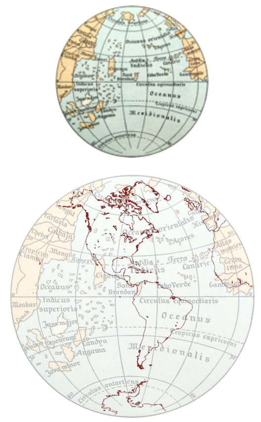

- **Small world**: the world under the model's assumptions. Bayesian models are optimal, in the small world

- **Larger world**: the real world. No guarantee of optimality for any kind of model

- Have to worry about both

???

When Columbus sailed west in the year 1492, he believed that the Earth was spherical.  In this, he was like most educated people of his day. He was unlike most of the people, though, in that he also believed that planet was much smaller than it actually is---only 30,000 km around its middle instead of the actual 40,000 km. This was one of the most consequential mistakes in European history. If Columbus had believed instead that the Earth was 40,000 km around, he would have correctly reasoned that his fleet could not carry enough food and potable water to complete a journey all the way westward to Asia. But at 30,000km around, Asia would lie a bit west of the coast of California. It was possible to carry enough supplies to make it that far. Emboldened in part by his unconventional estimate, Columbus set sail, eventually making landfall in the Bahamas. 

Columbus made a prediction based on his view that the world was small. But since he lived in a large world, aspects of the prediction were wrong. In his case, the error was lucky. His small world model was wrong in an unanticipated way: There was a lot of land in the way. If he had been wrong in an expected way, with nothing but ocean between Europe and Asia, he and his entire expedition would have run out of supplies long before reaching the East Indies. 

Columbus' small and large worlds provide a contrast between model and reality. All statistical modeling has these same two frames: the small world of the model itself and the large world we hope to deploy the model in. Navigating between these two worlds remains a central challenge of statistical modeling. The challenge is aggravated by forgetting the distinction. 

The circumference of Earth at the equator is about 24,874 miles (40,030 km), but from pole-to-pole — the meridional circumference — Earth is only 24,860 miles (40,008 km) around. This shape, caused by the flattening at the poles, is called an oblate spheroid.
---

## Garden of Forking Data

- The future:
    - Full of branching paths
    - Each choice closes some

- The data:
    - Many possible events
    - Each observation eliminates some

---

## Garden of Forking Data

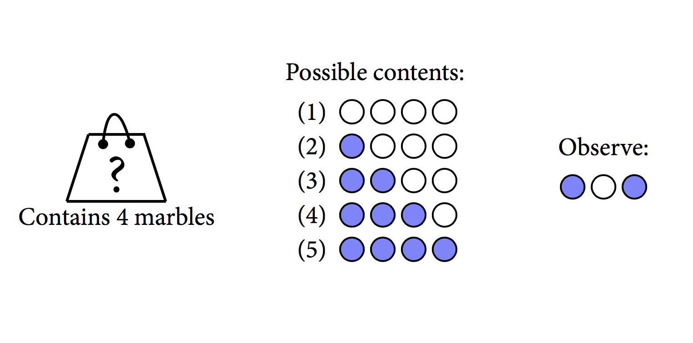
---

## Garden of Forking Data

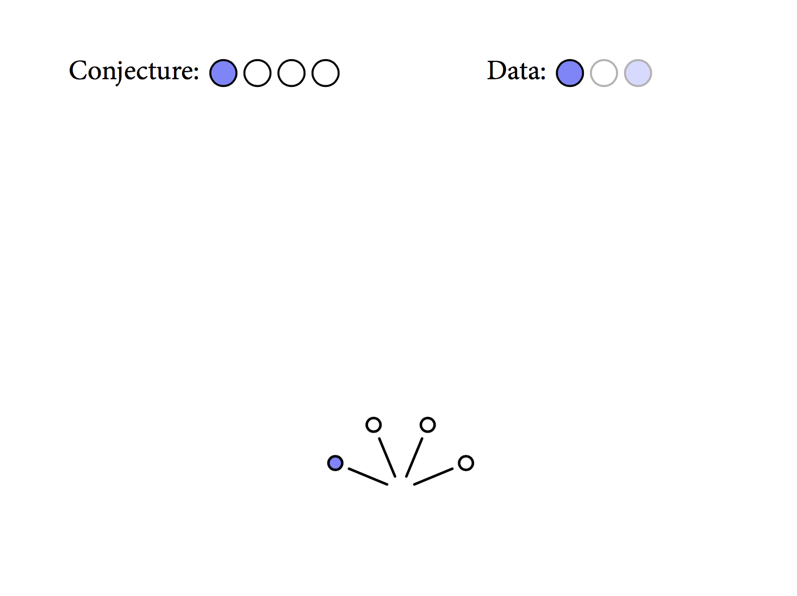
---

## Garden of Forking Data

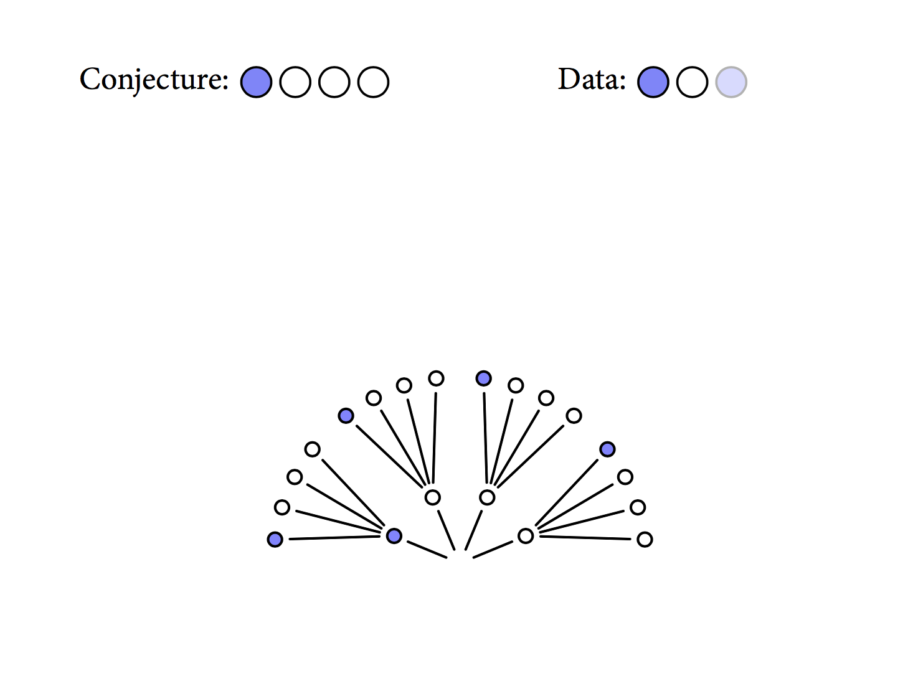
---

## Garden of Forking Data

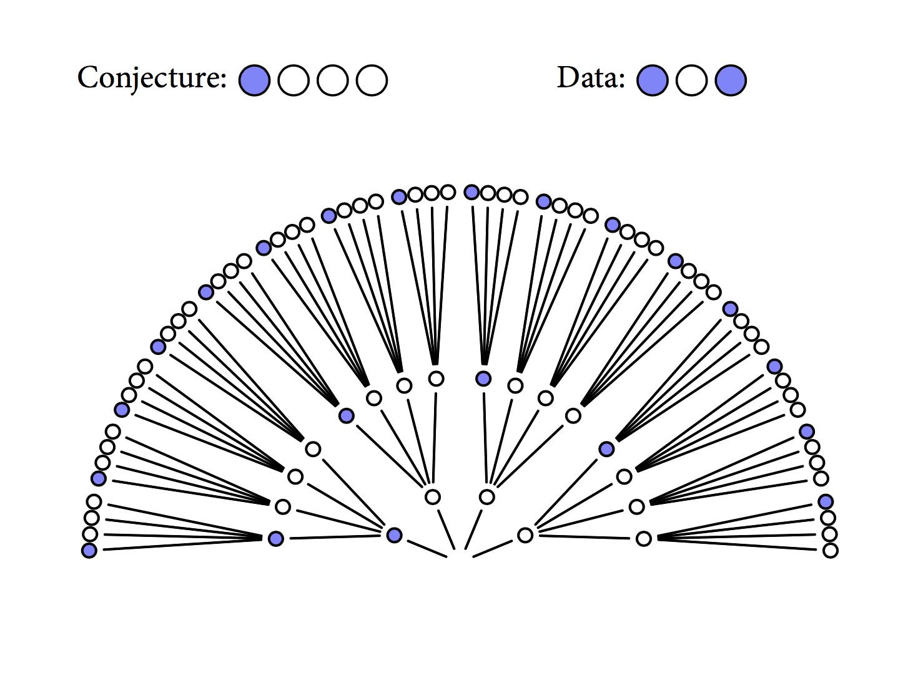
---

## Garden of Forking Data

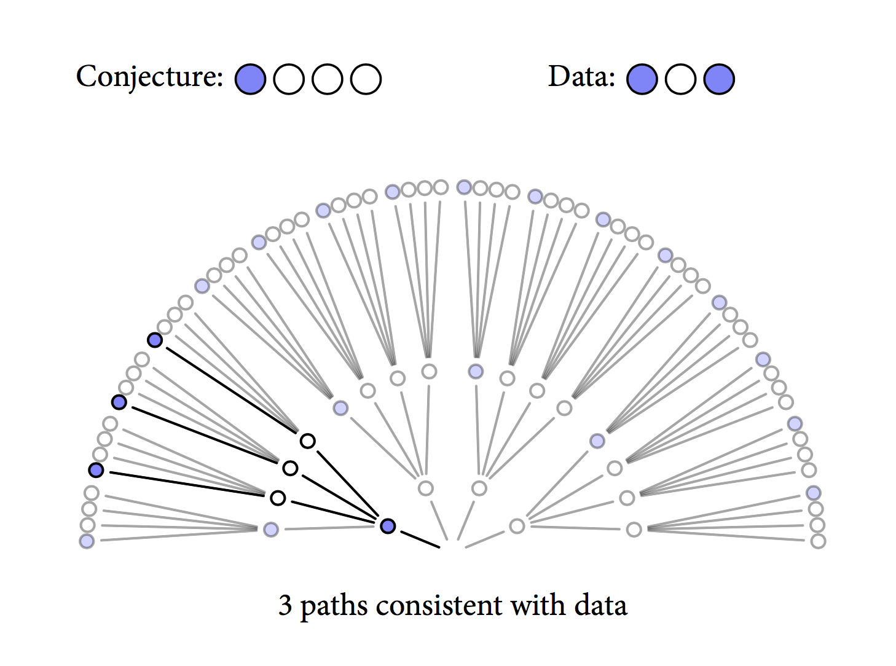

---

## Garden of Forking Data

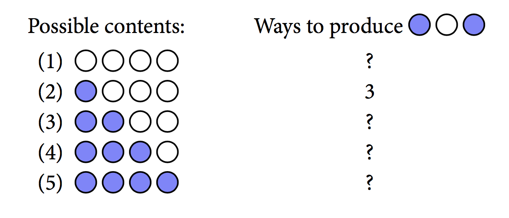

---

## Garden of Forking Data

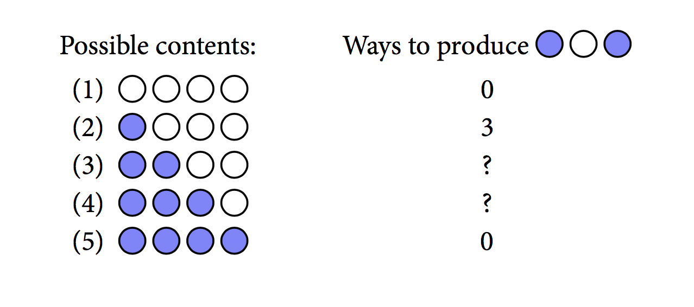

---

## 

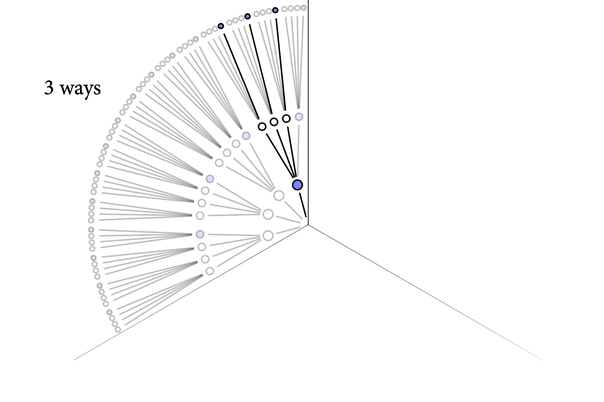

---

## 

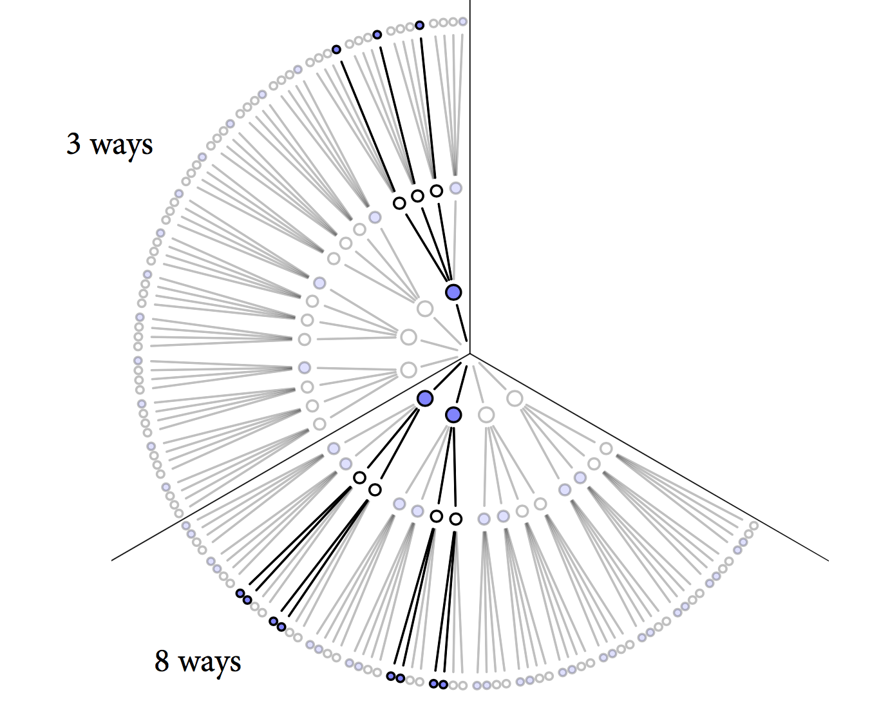

---

## 


---

## 

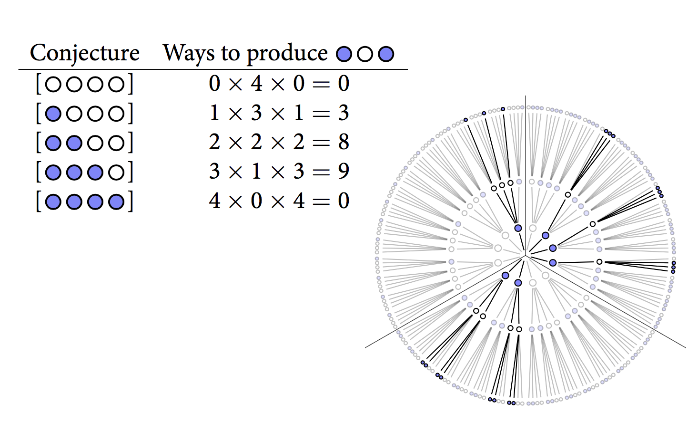

---

## Updating

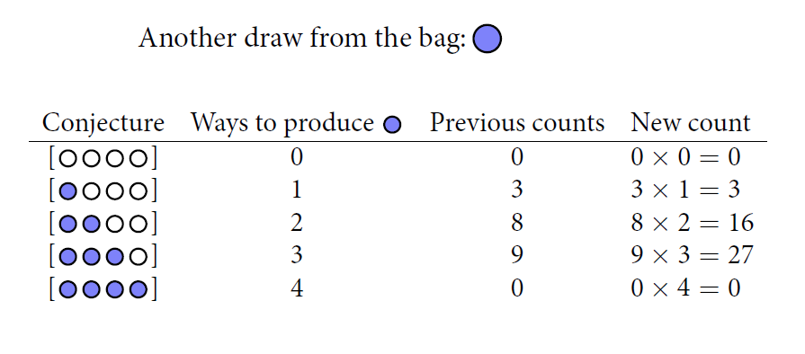

???

In this example, the prior data and new data are of the same type: marbles drawn from the bag. But in general, the prior data and new data can be of different types. 

---


## Using Prior Information

- Factory says: blue marble is rare but every bag contains at least one blue and one white


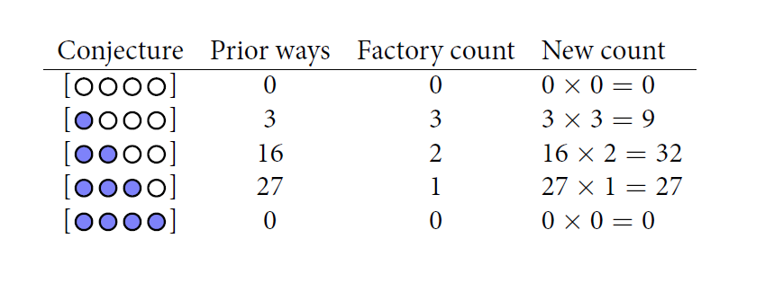

???

???
For 1 bag containing [bbbw], they made 2 bags containing[bbww] and 3 bags containing [bwww]. They also ensured that every bag contained at least 1 blue and 1 white.  

---

## Counts to plausibility

- The basis of applied probability:

> Things that can happen more ways are more plausible


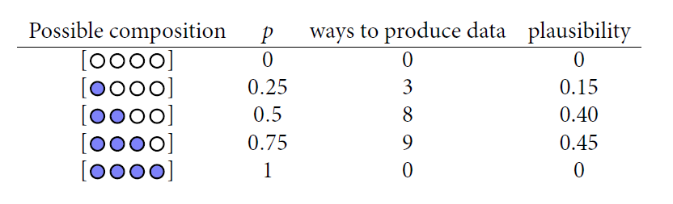

--

- Plausibility is probability: set of nonnegative real numbers that sum to one

- Probability theory is just a set of shortcuts for counting possibilities

---
class: inverse, center, middle

# Building a model

---
class: center

# Let's Toss A Coin

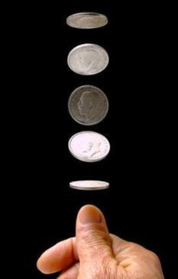

???
Let's go back to the most boring thing statisticians do: toss a coin

---

# Bayesian Model Design Loop

- Data story:  motivate the model by narrating how the data might arise

- Update: educate your model by feeding it the data

- Evaluate: supervision and revision

???
To get the logic moving, we need to make assumptions, and these assumptions constitute the model. Designing a simple Bayesian model benefit from a design loop with three steps.

---

# Data Story

- How do the data arise?

- For  [H T H H H T H T H]:

    - Some real property of the coin: "H" shows up with probability p; "T" with 1-p 
    
    - Each toss independent of each other

- Translate data story into probability statements

---

# Bayesian Updating 

- Bayesian Updating defines optimal learning in small world, converts _prior_ to _posterior_

    - Give your model an information state, before the data: here, we are confident that p is between 0 and 1
    
    - Condition on data to update information state: new confidence in each value of p, conditional on data

---
class: center, middle


---

# Bayesian Updating 


- Data order irrelevant (model assumption)

      - All-at-once = one-at-a-time = shuffled order
      
- Every posterior is a prior for next observation

- Every prior is posterior of some other inference

.footnote[
[1] R Code: https://github.com/happyrabbit/BayesianIntro
]

---

# Evaluate

- Bayesian inference: Logical answer to question in the form of a model

-  Evaluate:

    - Did the model malfunction?
    
    - Is the answer reasonable?
    
    - Does the question make sense?
    
    - Check sensitivity of answer to changes in assumptions

---

# Model Components

- Given:

    1. Likelihood

    1. Parameters

    1. Prior

- Deduce: Posterior

---

# Likelihood

- Pr(data|assumptions)

    - Defines probability of each observation, conditional "|" on assumptions

    - i.e. relative count of number of ways of seeing data, given a particular conjecture

- In this example, binomial probability:

    $$Pr(n_H| n, p) = \frac{n!}{n_{H}!(n-n_{H})!} p^{n_{H}} (1-p)^{n-n_{H}}$$

    ```r
    dbinom(6, size = 9, prob = 0.5)
    ## [1] 0.1640625
    ```
---

# Parameters

- Likelihood contains symbols: $n_{H}, n, p$

- Some are data: $(n_{H}, n)$

- Others parameters $(p)$

    - Define targets of inference, what is updated

    - These were the conjectures in the bag example

- Which are data and which parameters depend upon your context and questions

---

# Prior

- What do we believe before the data?

- Likelihood & prior define the model's perspective on the data

- Tossing coin example, a uniform (flat) prior

    $$Pr(p)=\frac{1}{1-0} = 1$$

--

- Huge literature on choice of prior

- Flat prior is conventional, but hardly ever best choice

    - Always know something (before data) that can improve inference
    
    - Are zero and one plausible values for $p$? Is $p<0.5$ as plausible as $p>0.5$?

    - Don't need to get it exactly right; just need to improve
    
---


# Posterior

- Bayesian estimate is always posterior distribution over parameters, Pr(parameter|data)

- Here: $Pr(p|n_{H})$

- Compute using Bayes' theorem:

    $$Pr(p|n_H)=\frac{Pr(n_H|P)Pr(p)}{Pr(n_H)}$$
    $$Posterior = \frac{Likelihood \times Prior}{Average\ Likelihood}$$
    
---
class: center, middle

#### Posterior is prior conditioned on evidence 
 
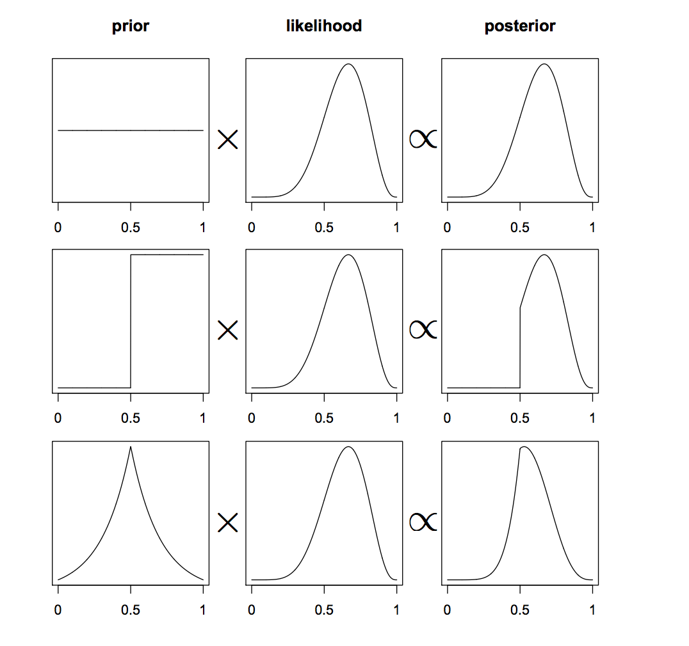

---

# Computing the posterior

1. Analytical approach (often impossible)

1. Grid approximation (very intensive)

1. Quadratic approximation (approximate)

1. Markov Chain Monte Carlo (intensive)

---

# Grid approximation

- The posterior is:
_standardized product of the likelihood and prior_

- Gird approximation uses _finite grid_ of parameter values instead of continuous space

```r
lth <- 10
p_grid <- seq( from=0 , to=1 , length.out=lth )
# define prior
prior <- rep( 1 , lth )
# compute likelihood at each value in grid
likelihood <- dbinom( 6 , size=9 , prob=p_grid )
# compute product of likelihood and prior
unstd.posterior <- likelihood * prior
# standardize the posterior, so it sums to 1
posterior <- unstd.posterior / sum(unstd.posterior)

plot(p_grid, posterior, type="b", ylab = "", xlab="", 
     labels=F, tick =F,main = paste("Grid length =", lth))
axis(side = 1, labels = T )
```

---

# Quadratic approximation

- Assume posterior is normally distributed

- Can estimate with two numbers (mean, standard deviation)

- Lots of algorithms

- With flat priors, same as conventional _maximum likelihood estimation_
