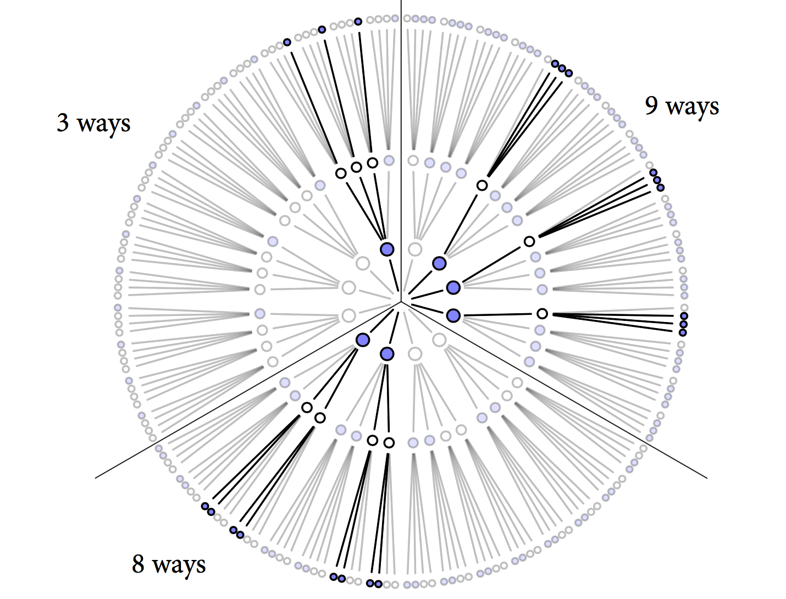

```{r setup, include=FALSE}
knitr::opts_chunk$set(echo = FALSE)
```

class: inverse, center, middle

# Bayesian Basic

---

## Outside view

> _Likelihood function: In statistics, a likelihood function is a function of parameters of a statistical model given data. Likelihood functions play a key role in statistical inference, especially methods of estimating a parameter from a set of statistics. In informal contexts, "likelihood" is often used as a synonym for "probability". In statistics, a distinction is made depending on the roles of outcomes vs. parameters. Probability is used before data are available to describe possible future outcomes given a fixed value for the parameter. Likelihood is used after data are available to describe a function of a parameter for given outcome. [Wikipedia]_

---

## Outside view

- Data have distributions

- Parameters do not

- Distinguish _parameters_ and _statistics_

- Likelihood is not a probability distribution

- Imaginary _population_

- Bayes is sampling theory + priors

- Priors are uniquely subjective

---

## Conceptual friction

- Thinking data must look like likelihood function

- Degrees of freedom

- Sampling as source of all uncertainty (Bootstrap, the magic!?)
    - Estimate any aspect of the distribution of any quantity computed from data $\mathbf{Z}=(z_1,\dots, z_N)$ with $z_i=(x_i, y_i)$
    - Estimate prediction error: Pr{observation i $\in$ sample b}

<!--
- Defining random effects via sampling design
- Neglect of data uncertainty
-->

---

## Bayesian data analysis

- Contrast with frequentist view
    - Probability is just limiting frequency
    - Uncertainty arises from sampling variation

- Bayesian probability much more general
    - Probability is in the small world
    - Coins are not random, but our ignorance makes them so

- Claim: Bayes easier and more powerful when understood from the inside

- Problem: Many insider views

---

## Small and Large Worlds


- **Small world**: the world under the model's assumptions. Bayesian models are optimal, in the small world

- **Larger world**: the real world. No guarantee of optimality for any kind of model

- Have to worry about both

---

## Garden of Forking Data

- The future:
    - Full of branching paths
    - Each choice closes some

- The data:
    - Many possible events
    - Each observation eliminates some

---

## Garden of Forking Data


---

## Garden of Forking Data


---

## Garden of Forking Data


---

## Garden of Forking Data


---

## Garden of Forking Data


---

## Garden of Forking Data


---

## Garden of Forking Data


---

## 


---

## 


---

## 



---

## 


---

## Updating


???

In this example, the prior data and new data are of the same type: marbles drawn from the bag. But in general, the prior data and new data can be of different types. 

---


## Using Prior Information

- Factory says: blue marble is rare but every bag contains at least one blue and one white


???

???
For 1 bag containing [bbbw], they made 2 bags containing[bbww] and 3 bags containing [bwww]. They also ensured that every bag contained at least 1 blue and 1 white.  

---

## Counts to plausibility

- The basis of applied probability:

> Things that can happen more ways are more plausible


--

- Plausibility is probability: set of nonnegative real numbers that sum to one

- Probability theory is just a set of shortcuts for counting possibilities

---
class: inverse, center, middle

# Building a model

---
class: center

# Let's Toss A Coin


???
Let's go back to the most boring thing statisticians do: toss a coin

---

# Bayesian Model Design Loop

- Data story:  motivate the model by narrating how the data might arise

- Update: educate your model by feeding it the data

- Evaluate: supervision and revision

???
To get the logic moving, we need to make assumptions, and these assumptions constitute the model. Designing a simple Bayesian model benefit from a design loop with three steps.

---

# Data Story

- How do the data arise?

- For  [H T H H H T H T H]:

    - Some real property of the coin: "H" shows up with probability p; "T" with 1-p 
    
    - Each toss independent of each other

- Translate data story into probability statements

---

# Bayesian Updating 

- Bayesian Updating defines optimal learning in small world, converts _prior_ to _posterior_

    - Give your model an information state, before the data: here, we are confident that p is between 0 and 1
    
    - Condition on data to update information state: new confidence in each value of p, conditional on data
